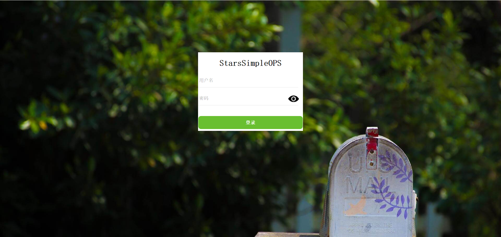
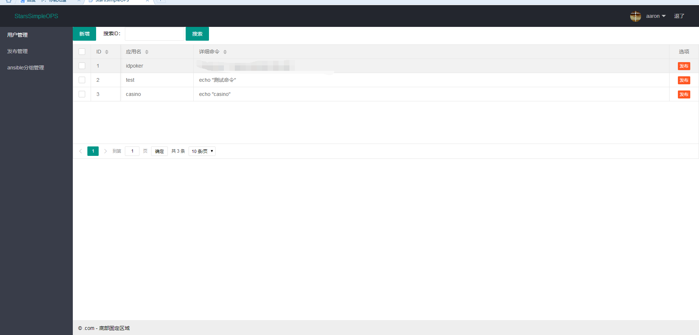

## StarsSimpleOps

## 简介

<strong>
StarsSimpleOps -- 为简化本人自己的工作流程而开发的一套自动化运维平台。
Django
</strong>

## 环境
+ 操作系统 Centos7
+ Django 1.11.7
+ Python 3.6.1
+ sqlite3

## 依赖
+ 暂无

## 安装
+ cd init && python init.py

## 启动
+ python3 manage.py runserver

## [Demo](# "demo页")
## 登录页面

##  发布管理页
